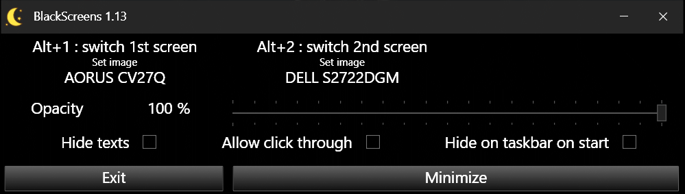

# Windows BlackScreens Application

BlackScreens is a Windows 10 Application that let you darken any of your current screen with simple keyboard shortcut switch: 

      Alt+1 --> Alt+6         Alt+0 to switch all screens at once

It work by showing, for each screen, an App Window on top of all others (system), with selected opacity (1% to 100%). An option for mouse clicking through the black windows now exist.

Main use cases for multiple screens users:
- need to watch one screen without being disturb by the other(s) screen(s)
- being sure that no one else can see one or multiple screen(s), for example in a presentation or web conference

## Download and install

No installation needed, just launch the executable you can download here https://github.com/BlueBird67/BlackScreens/releases/download/1.7/BlackScreens.exe [Current version 1.7 27/07/2020]

## Versions
- v1.08 (01/08/2020)
  Added mouse cursor disappeared on black screens after 3 sec., parameter in user preferences file. If on 0 (zero), mouse is no more disappearing
- v1.07 (27/07/2020)
  Adding ALT+0 key to switch all screens
- v1.06 (25/07/2020)
  Adding mouse clickthrough option
- v1.05 (21/07/2020)
  Adding screens positionning information on clipboard when left clicking on first screen name in the main parameters screen

## Tests

This App has been tested already on Windows 10 lastest officials builds on jully 2020, with 2 different screens.

BlackScreens works with DotNet 4.8. It has been built with Visual Studio 2019 Community edition.

It need testers in this cases:
- Older windows 10 builds (>1 year)
- Windows 8
- Windows 7
- More than 2 screens

Thank you.

## Other code used
- Wpf-Notificon from Hardcodet https://github.com/hardcodet/wpf-notifyicon/tree/master/src/NotifyIconWpf
- WindowsDisplayAPI from Falahati https://github.com/falahati/WindowsDisplayAPI/tree/master/WindowsDisplayAPI

## License

[GNU GPL v3.0](https://github.com/BlueBird67/BlackScreens/blob/master/LICENSE)

-the end-
